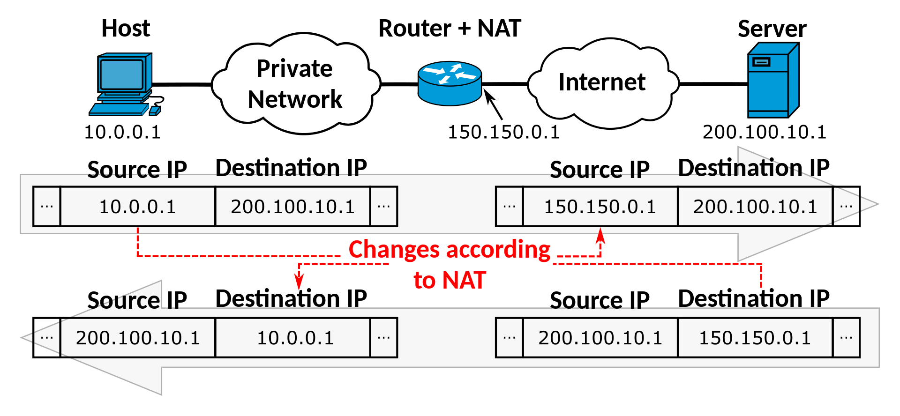

# Networking

## UPD Encapsulation

## OSI Model

## NAT

## Protocols

### IPv6

- Loopback: `::1/128`, equivalent to `127.0.0.1` in IPv4.
- Unspecified Adress: `::`
- Unique Local: `FC00::/7` to `FDFF::/7`
- Multicast:
  - All-devices: `FF02::1`

### ISO 15118-20

- ?
